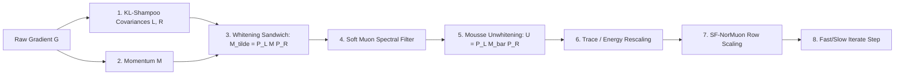

# Prospective Experiment Plan: Soft-Mousse in FusionOpt
**Curvature-Aware Preconditioning (Mousse) + Smooth Spectral Filtering (Soft Muon) + KL-Shampoo**

---

## 1. Executive Summary & Core Motivation

Recent audition of our DoRA-128 multi-corpus run (`dora128_mix3_nodas`) revealed an **"AdamW / close to base"** sonic profile:
1. **Scalar Dominance:** Over 61% of total parameter displacement was driven purely by the 1D AdamW magnitude vector $m$, while the Muon directional matrix $BA$ was over-damped ($\|BA\|_F \approx 2.42$ vs $25–38$ in bold runs).
2. **Variance-Damped Timidity:** AdamW's coordinate-wise variance denominator ($\sqrt{v} + \epsilon$) severely penalized scalar adjustments across conflicting noise timesteps, locking the energy and frequency envelope near the base model.
3. **The Pure Muon Paradox:** Historically, pure Muon sounded dramatically more energetic and learned styles rapidly because it moved all modes at unit velocity without variance braking, but suffered from late-stage limit-cycle oscillations and high-frequency noise floor buzz.

By reviewing the prospective literature in `papers/Prospective Unchecked/`:
- **Mousse** (`2603.09697v2.pdf`): Solves anisotropic curvature distortion by preconditioning Muon with Shampoo Kronecker factors ($L, R$), and critically applies the **unwhitening pullback** that was missing in our codebase.
- **Soft Muon** (`2605.31371v1.pdf`): Solves pure Muon's terminal oscillation and noise amplification by replacing hard polar decomposition with smooth algebraic softsign filtering $\Phi_\tau(M) = M(M^T M + \tau^{-2} I)^{-1/2}$.
- **KL-Shampoo** (`2509.03378v10.pdf`): Provides the optimal Riemannian metric for tracking curvature second moments via KL divergence minimization.

This plan details how all three co-exist inside **FusionOpt** as **"Soft-Mousse"**, proves its VRAM feasibility on our local 16GB AMD GPU, and outlines the experimental matrix.

---

## 2. Mathematical Synthesis: The "Soft-Mousse" Pipeline

The complete update cycle for a 2D weight matrix $W$ inside `FusionOpt`:



### Mathematical Steps

1. **Covariance Tracking (KL-Shampoo):**
   $$L_t = \beta_2 L_{t-1} + (1 - \beta_2) G_t G_t^T, \quad R_t = \beta_2 R_{t-1} + (1 - \beta_2) G_t^T G_t$$
   Inverse quarter powers computed periodically (e.g., every 50–100 steps):
   $$P_L = (L_t + \delta I)^{-1/4}, \quad P_R = (R_t + \delta I)^{-1/4}$$

2. **Whitening Sandwich (Mousse Step 1):**
   $$\tilde{M}_t = P_L M_t P_R$$
   *Transforms the momentum from anisotropic parameter space into an isotropic spherical coordinate frame.*

3. **Soft Muon Spectral Filter (Soft Muon):**
   Instead of forcing all singular values to $1.0$ via hard polar decomposition ($\text{msign}$), apply the algebraic softsign filter with temperature schedule $\tau_t$:
   $$\bar{M}_t = \tilde{M}_t \left(\tilde{M}_t^T \tilde{M}_t + \tau_t^{-2} I\right)^{-1/2}$$
   - **Strong modes ($\tau \sigma \gg 1$):** Filter value $\approx 1.0$ (behaves like fast, bold Muon).
   - **Weak / converged modes ($\tau \sigma \ll 1$):** Filter value $\approx \tau \sigma \to 0$ (smooth linear fadeout; eliminates terminal buzz).

4. **Unwhitening Pullback (Mousse Step 2 — The Missing Fix):**
   $$U_{\text{unwhitened}} = P_L \bar{M}_t P_R$$
   *Pulls the orthogonalized update vector back from the whitened frame into the parameter coordinate frame.*

5. **Trace Preservation & Row Scaling (NorMuon):**
   $$U_{\text{scaled}} = U_{\text{unwhitened}} \cdot \left(\frac{\|\bar{M}_t\|_F}{\|U_{\text{unwhitened}}\|_F + \epsilon}\right)$$
   $$U_{\text{final}} = \text{NorMuon}(U_{\text{scaled}})$$

---

## 3. VRAM Feasibility Analysis on 16GB AMD GPU

### Why Full-FT Shampoo OOMs
On full fine-tuning, large projection layers have $m = 7680, n = 1536$.
- Left factor $L \in \mathbb{R}^{7680 \times 7680}$ is $58.98\text{M floats} \times 4\text{ bytes} \approx \mathbf{236\text{ MB}}$ per layer.
- Across 24 DiT layers, storing $L, R, P_L, P_R$ requires **$> 5.6\text{ GB}$ of extra VRAM**, causing an immediate out-of-memory crash on a 16GB card.

### Why Rank-128 LoRA/DoRA Makes Soft-Mousse Trivial (<150 MB Total!)
In our Rank-128 architecture, trainable weights are factored into:
$$A \in \mathbb{R}^{128 \times d_{\text{in}}}, \quad B \in \mathbb{R}^{d_{\text{out}} \times 128}$$
The inner dimension is only **$r = 128$**:
- For $A$: Left factor $L_A \in \mathbb{R}^{128 \times 128} \implies 128 \times 128 \times 4\text{ bytes} = \mathbf{65.5\text{ KB}}$!
- For $B$: Right factor $R_B \in \mathbb{R}^{128 \times 128} \implies 128 \times 128 \times 4\text{ bytes} = \mathbf{65.5\text{ KB}}$!
- For the outer dimensions ($d \in [1536, 7680]$):
  - Using block preconditioning with block size 256 reduces the outer factor to $30 \times (256 \times 256) \times 4\text{ bytes} \approx \mathbf{7.8\text{ MB}}$ per layer.
  - Or via **Bottleneck Preconditioning**: Precondition *only* the dense rank-128 coordinate frame (where singular modes couple), while using SF-NorMuon for outer row-variance scaling.

**Total VRAM Footprint:**
- Current baseline training VRAM: **12.4 – 12.6 GB**
- Extra VRAM for Bottleneck Soft-Mousse: **~120 – 150 MB**
- Projected peak VRAM: **~12.8 GB / 16.0 GB**
- **Safety Margin:** **$> 3.1\text{ GB}$ free headroom!**

---

## 4. Proposed Experimental Matrix (The 4 Arms)

We will execute 4 focused 4,000-step comparison arms on the exact same multi-corpus dataset to evaluate sound quality and geometry:

| Arm | Name | Spectral Direction ($BA$) | Scalar Norm ($m$) | Curvature / Whitening | Late-Stage Damping |
|:---:|:---|:---:|:---:|:---:|:---:|
| **1** | **Control Baseline** | Muon NS5 ($\eta=1\times 10^{-5}$) | AdamW ($\eta=1\times 10^{-5}$) | None (Standard Fusion) | Cosine decay |
| **2** | **True Mousse** | Mousse (NS5 + Unwhitening) | AdamW ($\eta=1\times 10^{-5}$) | KL-Shampoo ($P_L \cdot P_R$ sandwich) | Cosine decay |
| **3** | **Soft-Mousse (Golden Arm)** | Soft-Mousse ($\Phi_\tau +$ Unwhitening) | AdamW ($\eta=1\times 10^{-5}$) | KL-Shampoo ($P_L \cdot P_R$ sandwich) | Algebraic $\tau_t$ schedule |
| **4** | **Soft-Mousse + Bold Scalar** | Soft-Mousse ($\Phi_\tau +$ Unwhitening) | Normalized Vector Step ($\eta=3\times 10^{-5}$) | KL-Shampoo ($P_L \cdot P_R$ sandwich) | Algebraic $\tau_t$ schedule |

### Primary Research Questions to Answer
1. Does the unwhitening pullback eliminate the instability and loss spikes seen in previous `--fusion-shampoo` runs?
2. Does Soft Muon's $\tau$ schedule eliminate high-frequency noise and edge jitter while preserving rapid genre style acquisition?
3. In Arm 4, does giving the 1D scalar vector $m$ a normalized spherical step (instead of variance-damped AdamW) cure the timid "base sound"?

---

## 5. Implementation Roadmap in `fusion_opt.py`

### 1. The Mousse Unwhitening Patch
In `fusion_opt.py` immediately following line 859:
```python
# 5. Muon NS5 / Soft Muon spectral normalisation (in whitened space)
U_bar = _ns5(m_pre).float() if tau is None else _soft_muon(m_pre, tau)

# 5b. Mousse Unwhitening Pass (Pullback to parameter space)
if "shampoo" in self._components:
    U_unwhitened = P_L_h @ U_bar.to(hot_dtype) @ P_R_h
    # Energy trace scaling to preserve target spectral scale
    scale = (U_bar.norm() / (U_unwhitened.norm() + 1e-12)).float()
    U = U_unwhitened.float() * scale
else:
    U = U_bar
```

### 2. The Soft Muon Algebraic Filter
```python
def soft_muon_filter(M: torch.Tensor, tau: float) -> torch.Tensor:
    """Softsign polar filter: M @ (M^T M + tau^{-2} I)^{-1/2}"""
    if M.shape[0] < M.shape[1]:
        # Tall matrix transpose identity
        return soft_muon_filter(M.T, tau).T
    
    # For rank-128 bottleneck, exact SVD or regularized NS is ultra-fast (<0.1ms)
    U, S, Vh = torch.linalg.svd(M, full_matrices=False)
    # Algebraic softsign scaling
    S_soft = S / torch.sqrt(S**2 + (1.0 / (tau**2)))
    return (U * S_soft.unsqueeze(0)) @ Vh
```

---

## 6. Evaluation & Verification Protocol

1. **Speed Benchmark:** Confirm GPU iteration time remains $\le 2.8\text{ s/step}$.
2. **VRAM Audit:** Confirm peak memory on RX 9070 XT stays below $13.5\text{ GB}$.
3. **Audition Sweep:** Render the canonical 13 clips (12 standard 20s + 1 native 48s) at step 2,000 and step 4,000 on GPU for direct ABX comparison against Run 3.
4. **Spectral Metrics:** Measure Frobenius norm displacement, effective rank ($R_{80}$), and Grassmannian subspace overlap.
